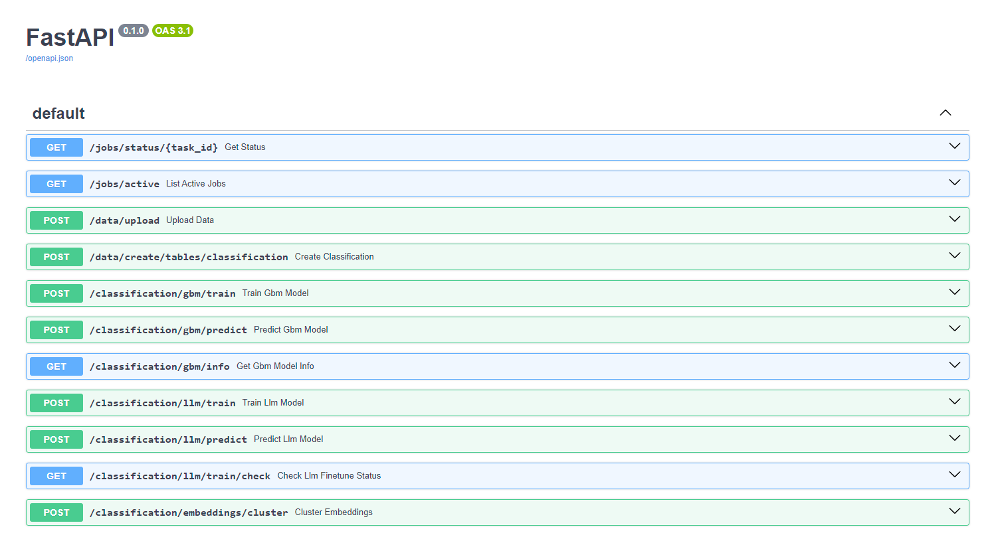


# binnr (data-binnr)
<p align="center">
  
</p>
binnr is a tool designed for textual classification, leveraging the power of Snowflake. It employs a range of machine learning algorithms such as GBM, LLM, and KMeans clustering to analyze and categorize text data. The tool features a FastAPI interface, enabling users to upload data, establish classification tables, train various models, make predictions, and cluster embeddings. binnr is optimized for high performance (even with large datasets), by utilizing Snowpark capabilities.

## Package Requirements

Ensure you have the following Python packages installed:

- fastapi
- uvicorn
- pydantic
- celery
- redis
- python-dotenv
- swagger-ui-bundle
- snowflake-ml-python
- snowflake-snowpark-python==1.18.0
- scikit-learn==1.3.0
- pandas
- sqlalchemy
- snowflake-connector-python
- snowflake-connector-python[pandas]
- snowflake-sqlalchemy

## How to Run

1. **Clone the repository:**
   ```
   sh
   git clone <repository-url>
   cd <repository-directory>
   ```

2. **Set up your environment**:
##### Note SnowFlake account must be in AWS-Orgeon or other Cortex supported zone

Create a .env file in the root directory and add the following environment variables:

```
CELERY_BROKER_URL=redis://redis:6379/0
CELERY_RESULT_BACKEND=redis://redis:6379/0
SNOWFLAKE_CONFIG='{
    "user": "<your-snowflake-username>",
    "password": "<your-snowflake-password>",
    "account": "<your-snowflake-account>",
    "warehouse": "<default-warehouse>",
    "database": "<default-database>",
    "schema": "<default-schema>",
    "role": "<default-role>"
}'
```

**Build and run the Docker containers:**

`docker-compose up --build`

# API Endpoints Overview

## `/data/upload`
**Description:** Upload a file and initiate a long-running job to load data into Snowflake. This process creates its own stage automatically. 
**Important ensure all column headers in the upload file are lowercase.**

- **Method:** POST
- **Parameters:**
  - `file` (UploadFile): The file to upload.
  - `table_name` (str): The name of the table to create in Snowflake.
  - `database` (str, optional): The name of the database.
  - `schema` (str, optional): The name of the schema.
  - `warehouse` (str, optional): The name of the warehouse.
  - `role` (str, optional): The role to use.
- **Returns:** The task ID of the Celery job.

## `/data/create/tables/classification`
**Description:** Create classification tables in Snowflake.

- **Method:** POST
- **Parameters:** (ClassificationRequest)
  - `table_name` (str): The name of the table.
  - `source_columns` (list[str]): The source columns for classification.
  - `target_column` (str): The target column for classification.
  - `database` (str, optional): The name of the database.
  - `schema` (str, optional): The name of the schema.
  - `warehouse` (str, optional): The name of the warehouse.
  - `role` (str, optional): The role to use.
  - `template` (str, optional): A template for formatting, source column will be formatted using this template.
  - `create_validation` (bool, optional): Whether to create validation on training data(split is random 90-10).
  - `llm_train_source` (bool, optional): Whether to prepare data to train LLM's. Creates prompts for LLM training in source column.
- **Returns:** Combination of source columns as concat string, in template format or concatinated using ':'. Takes target column and creates target table of target column and target column numbered. The source and target columns numbered added to a copy of base table, training, validation and predict tables(Targets not being defined would be null).

## `/classification/gbm/train`
**Description:** Train a GBM classification model in Snowflake.

- **Method:** POST
- **Parameters:** (GBMTrainRequest)
  - `training_table` (str): The training table name.
  - `database` (str, optional): The name of the database.
  - `schema` (str, optional): The name of the schema.
  - `warehouse` (str, optional): The name of the warehouse.
  - `role` (str, optional): The role to use.
- **Returns:** Model name.

## `/classification/gbm/predict`
**Description:** Generate predictions using a trained GBM classification model in Snowflake.

- **Method:** POST
- **Parameters:** (GBMPredictRequest)
  - `model_name` (str): The name of the model.
  - `predict_table` (str): The table to predict.
  - `database` (str, optional): The name of the database.
  - `schema` (str, optional): The name of the schema.
  - `warehouse` (str, optional): The name of the warehouse.
  - `role` (str, optional): The role to use.
- **Returns:** Results table.

## `/classification/gbm/info`
**Description:** Retrieve model evaluation metrics for a GBM classification model in Snowflake.

- **Method:** GET
- **Parameters:**
  - `model_name` (str): The name of the model.
  - `database` (str, optional): The name of the database.
  - `schema` (str, optional): The name of the schema.
  - `warehouse` (str, optional): The name of the warehouse.
  - `role` (str, optional): The role to use.
- **Returns:** The model evaluation metrics.

## `/classification/llm/train`
**Description:** Train an LLM classification model in Snowflake.

- **Method:** POST
- **Parameters:** (LLMTrainRequest)
  - `training_table` (str): The training table name.
  - `validation_table` (str): The validation table name.
  - `target_column` (str): The target column.
  - `database` (str, optional): The name of the database.
  - `schema` (str, optional): The name of the schema.
  - `warehouse` (str, optional): The name of the warehouse.
  - `role` (str, optional): The role to use.
  - `model_type` (str, optional): The model type (default: 'llama3-8b'). More at - https://docs.snowflake.com/en/user-guide/snowflake-cortex/cortex-finetuning
- **Returns:** Finetune job id.

## `/classification/llm/predict`
**Description:** Generate predictions using a trained LLM classification model in Snowflake.

- **Method:** POST
- **Parameters:** (LLMPredictRequest)
  - `model_name` (str): The name of the model.
  - `predict_table` (str): The table to predict.
  - `database` (str, optional): The name of the database.
  - `schema` (str, optional): The name of the schema.
  - `warehouse` (str, optional): The name of the warehouse.
  - `role` (str, optional): The role to use.
- **Returns:** Results table.

## `/classification/llm/train/check`
**Description:** Check the status of an LLM fine-tuning job in Snowflake.

- **Method:** GET
- **Parameters:**
  - `job_id` (str): The job ID of the fine-tuning job.
  - `database` (str, optional): The name of the database.
  - `schema` (str, optional): The name of the schema.
  - `warehouse` (str, optional): The name of the warehouse.
  - `role` (str, optional): The role to use.
- **Returns:** The status and progress of the fine-tuning job.

## `/classification/embeddings/cluster`
**Description:** Cluster vector embeddings and run KMeans to identify where unmarked records belong.

- **Method:** POST
- **Parameters:** (EmbeddingsClusterRequest)
  - `input_table` (str): The input table name.
  - `number_of_iterations` (int): The number of iterations for KMeans. Default=2
  - `database` (str, optional): The name of the database.
  - `schema` (str, optional): The name of the schema.
  - `warehouse` (str, optional): The name of the warehouse.
  - `role` (str, optional): The role to use.
- **Returns:** Returns results table with clusters.

# Algorithms Overview

## GBM (Gradient Boosting Machine)
GBM is an ensemble learning method that builds models in a stage-wise fashion. It optimizes for accuracy by combining the strengths of multiple weak models, typically decision trees, to create a strong predictive model. The GBM training process involves sequentially training new models to correct the errors made by previously trained models.

## LLM (Large Language Model)
LLMs are deep learning models that are trained on a massive corpus of text data. They can generate human-like text based on the input they receive. The training involves fine-tuning the model on specific datasets to improve its accuracy in understanding and generating text related to a particular domain.

## KMeans Clustering
KMeans is an unsupervised learning algorithm used for clustering. It partitions data into K clusters, where each data point belongs to the cluster with the nearest mean value. The algorithm iteratively refines the cluster centroids to minimize the within-cluster variance.

## Embeddings
Embeddings are low-dimensional vector representations of high-dimensional data, such as text. They capture the semantic meaning of the data, enabling algorithms to perform operations like clustering and classification more effectively. In this tool, embeddings are used to cluster textual data and identify the most similar target for unmarked records.

# Example
Lets start the application.
1. Download the code
2. Install/start docker
3. Add snowflake user credentials to .env file
4. Run `docker-compose up --build`
5. Open the browser and go to `http://localhost:8000`

At this point you should see the following:
<p align="center">
  
</p>

Now, lets try loading the following data into Snowflake:
Src - https://www.kaggle.com/datasets/cwthompson/tweetsentimentextraction2020completepseudo
- We get the CSV extra_data.csv from the link.
- Lets call our table 'tweets' and ensure all the column headers are lowercase in the file. Then select a schema to work on and upload the file to target table using the following swagger endpoint `/data/upload`.
- We can always check status of background running tasks anytime at `/jobs/active`, in this case lets wait for it to finish uploading.
- Next lets radomly seed 5-10% nulls in our dataset on the 'sentiment' column of 'tweets' table .(Hint: SQL is a useful tool to do this)
- Now lets prepare the data for training. This is done by running the following swagger endpoint `/data/create/tables/classification`. 
Here, schema = our working schema, table_name = 'tweets', target_column = 'sentiment', source_columns =['author','text'], template = 'Author : {'author'}, Tweet: {'text'}', create_validation = false, llm_train_source = false. This will create the following tables in schema sentiment, temp_tweets_source_target,tweets_source_target_train and tweets_source_target_predict.
- Next lets train a model at `/classification/gbm/train`. schema = our working schema, training_table = 'tweets_source_target_train'. Now sit back have a cup of coffee and wait for the training to complete. Once the task will give us a model_name.
- To predict results, we need to run the following swagger endpoint `/classification/gbm/predict`. Here, schema = our working schema, model_name = from the previous step, predict_table = 'tweets_source_target_predict'. At the end of this job it will produce a results table with predicted class.
- Now lets check the accuracy of the model. This is done by running the following swagger endpoint `/classification/gbm/accuracy`.

# License
This project is licensed under the FreeBSD License. This license allows for the free use, modification, and distribution of the software, even for commercial purposes, under the condition that the original copyright notice and this permission notice are included in all copies or substantial portions of the software.

### To modify Snowflake methods and algorithms, modify the files in the path `/app/Snowflake`
### As this is FreeBSD software I am no liable for warranty. But as stated above you can modify and optimize the code anytime.

# FAQ
- Want to add other algorithms or processes? 
ANS: Add your code to `/app/Snowflake` and modify `/app/main.py`. If long running celery job is required, add it to `/app/job.py` and modify `/app/main.py`.

- Want to simplify MLOps?
ANS: Have different versions of binnr in repo to deployed different versions of you models.

- Want an easy way to interact with SnowPark from local machine?
ANS: Run binnr locally and use the swagger UI to interact with SnowPark.

- Want to add auth for production environment?
ANS: Add your code to modify `/app/main.py`.

- Want to train an LLM model, easily for production?
ANS: Add your code to `/app/Snowflake`, train the model and modify `/app/main.py` to create route to take LLM prompts as input and repond with completions for your application. **Bonus if historical data is stored. Can retrain the model at night**.
